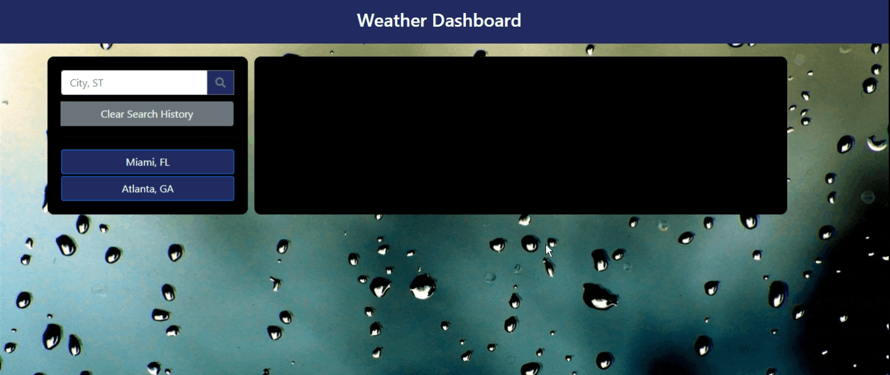

# Weather Dashboard
Not everyone has an Alexa in their bedroom or living room.  Fortunately, this desktop and mobile-responsive weather dashboard will give you both current and future weather information with just the click of a button.  

Check it out [here](https://smcmillan28.github.io/weather-dashboard-hw/) and read the guide below for additional explanation!

## Table of Contents

[Dashboard Functionality](#dashboard-functionality)\
[Visual Representation](#visual-representation)\
[Code Used and Credits](#code-used-and-credits)\
[Project Takeaways](#project-takeaways)

## Dashboard Functionality
When the page first loads, you will be presented with a search bar and a blank screen.  Once you enter a city into the search bar and click the search button, the following information will be presented:

### Current Weather:
- City and Current Date
- An icon representing current weather conditions
- Temperature
- Wind Speed
- Humidity
- UV Index with color-code representing UV intensity
### Five-Day Forecast:
- Upcoming dates
- An icon representing projected weather conditions for each upcoming day
- Temperature 
- Humidity

The cities that you search for will be saved on the left hand side of the screen.  If you want to view that city's weather data again, just click the button! Ready to clear search history and start over?  Just click the "Clear Search History" button.  

The visual representation below paints a clear picture of the dashboard's functionality.

## Visual Representation

The following animation demonstrates the application functionality:

## Code Used and Credits

- HTML/CSS
- JavaScript/jQuery
- [Bootstrap](https://getbootstrap.com/)
- [Moment.js](https://momentjs.com/)
- [OpenWeather API](https://openweathermap.org/api)
- [OpenCage Geocode API](https://opencagedata.com/api)
- [Font Awesome](https://fontawesome.com/)

## Project Takeaways
We were once again challenged to incorporate skills learned in recent lessons.  We were again called to use jQuery event listeners and selectors to trigger functions that manipulated the DOM, but this was the first project that forced us to use AJAX calls through third-party APIs to retrieve data for the user.  

The other challenge with this project was that there was no starter code.  All of the HTML/CSS was written from scratch.  My three primary takeaways from this project were:

- Getting familiar with writing jQuery AJAX calls for use third-party API use
- Writing data to local storage in the form of an array and rendering data from local storage in the form of buttons
- Reading/researching API documentation to set up object references from JSON results